# Provisioning a New RHEL VM using AI Assistant and Terraform Cloud

## Architecture Diagram

```mermaid
graph TB
    User[👤 User/DevOps Engineer]
    
    subgraph OpsAgent["OpsAgent System"]
        Router[🔀 Router/Coordinator<br/>Routes based on keywords]
        TerraformAgent[🤖 Terraform Agent<br/>LangGraph ReAct Agent<br/>RHEL 9 VM Workflow Knowledge]
    end
    
    subgraph MCP["MCP Integration Layer"]
        MCPManager[MCP Manager]
        TerraformMCP[Terraform MCP Server<br/>71 tools]
    end
    
    subgraph TFC["Terraform Cloud"]
        TFCApi[Terraform Cloud API<br/>app.terraform.io]
        Workspace[Workspace<br/>openshift-cluster-management<br/>Execution: Remote]
        Variables[Workspace Variables<br/>━━━━━━━━━━━━━━━<br/>Env Variables:<br/>• KUBE_HOST<br/>• KUBE_TOKEN<br/>• KUBE_CLUSTER_CA_CERT_DATA<br/>━━━━━━━━━━━━━━━<br/>Terraform Variables:<br/>• vm_name<br/>• vm_namespace<br/>• vm_ssh_public_key<br/>• vm_cpu_cores<br/>• vm_memory<br/>• vm_image_url]
        VCS[VCS Repository<br/>GitHub/GitLab<br/>━━━━━━━━━━━━━━━<br/>• main.tf<br/>• variables.tf<br/>• outputs.tf<br/>• cloud-init.yaml]
        TFRun[Terraform Run<br/>run-T8yKe3taG7tymoco<br/>━━━━━━━━━━━━━━━<br/>Phase 1: Plan<br/>Phase 2: Apply]
    end
    
    subgraph TFExec["Terraform Execution Environment"]
        TFInit[terraform init<br/>Download providers]
        TFPlan[terraform plan<br/>Preview changes]
        TFApply[terraform apply<br/>Create resources]
        KubeProvider[Kubernetes Provider<br/>hashicorp/kubernetes<br/>Authenticates to OpenShift]
        TFState[Terraform State<br/>Resource tracking<br/>Stored in TFC]
    end
    
    subgraph OCP["OpenShift Virtualization Platform"]
        OCPApi[OpenShift API Server<br/>api.cluster.example.com:6443]
        Namespace[Namespace<br/>rhel9-vms]
        CloudInit[CloudInit ConfigMap<br/>User data, SSH keys<br/>Network config]
        VM[VirtualMachine CRD<br/>rhel9-demo-vm<br/>━━━━━━━━━━━━━━━<br/>CPU: 2 cores<br/>Memory: 4Gi<br/>Running: true]
        VMI[VirtualMachineInstance<br/>Pod: virt-launcher-rhel9-demo-vm<br/>━━━━━━━━━━━━━━━<br/>Status: Running<br/>IP: 10.128.2.50]
        ContainerDisk[Container Disk Image<br/>quay.io/containerdisks/rhel9:latest]
    end
    
    User -->|Deploy RHEL 9 VM using Terraform Cloud<br/>Org: ocp-virt-tfe-demo<br/>Workspace: openshift-cluster-management<br/>Credentials already configured| Router
    
    Router -->|Keyword analysis:<br/>Deploy, Terraform<br/>→ terraform_agent| TerraformAgent
    
    TerraformAgent -->|1. list_workspaces| TerraformMCP
    TerraformMCP -->|GET /organizations/.../workspaces| TFCApi
    TFCApi -->|Workspace found| Workspace
    Workspace -->|Workspace details| TerraformMCP
    TerraformMCP -->|Workspace exists ✓| TerraformAgent
    
    TerraformAgent -->|2. list_workspace_variables| TerraformMCP
    TerraformMCP -->|GET /workspaces/.../vars| TFCApi
    TFCApi -->|Variable list| Variables
    Variables -->|KUBE_HOST ✓<br/>KUBE_TOKEN ✓ (masked)<br/>vm_* variables ✓| TerraformMCP
    TerraformMCP -->|All variables exist ✓| TerraformAgent
    
    TerraformAgent -->|3. create_run<br/>workspace_id<br/>message: Deploy RHEL 9 VM<br/>is_destroy: false| TerraformMCP
    TerraformMCP -->|POST /runs| TFCApi
    TFCApi -->|Create run| TFRun
    TFRun -->|Run ID| TerraformMCP
    TerraformMCP -->|Run created ✓<br/>ID: run-T8yKe3taG7tymoco| TerraformAgent
    
    TFRun -->|Fetch latest code| VCS
    VCS -->|Clone repository| TFRun
    
    TFRun -->|Execute| TFInit
    TFInit -->|Download| KubeProvider
    TFInit -->|Providers ready| TFPlan
    
    TFPlan -->|Load| Variables
    TFPlan -->|Read state| TFState
    TFPlan -->|Generate plan:<br/>+ Create namespace<br/>+ Create ConfigMap<br/>+ Create VirtualMachine| TFRun
    
    Note1[User manually approves<br/>in Terraform Cloud UI] -.->|Approval| TFRun
    
    TFRun -->|After approval| TFApply
    TFApply -->|Use credentials| Variables
    
    TFApply -->|Authenticate| KubeProvider
    KubeProvider -->|Bearer token auth| OCPApi
    
    KubeProvider -->|1. Create/verify namespace| OCPApi
    OCPApi -->|Create| Namespace
    Namespace -->|Created/exists| KubeProvider
    
    KubeProvider -->|2. Create CloudInit ConfigMap| OCPApi
    OCPApi -->|Create| CloudInit
    CloudInit -->|Created| KubeProvider
    
    KubeProvider -->|3. Create VirtualMachine| OCPApi
    OCPApi -->|Create| VM
    VM -->|Created| KubeProvider
    
    KubeProvider -->|Resources created| TFApply
    TFApply -->|Update state| TFState
    TFState -->|State saved| TFRun
    
    OCPApi -->|Start VM| VM
    VM -->|Launch| VMI
    VMI -->|Pull image| ContainerDisk
    ContainerDisk -->|Image downloaded| VMI
    VMI -->|Apply config| CloudInit
    CloudInit -->|User data applied| VMI
    VMI -->|VM running| VM
    
    TFRun -->|Run status updates| TFCApi
    
    TerraformAgent -->|4. get_run_details (monitoring)| TerraformMCP
    TerraformMCP -->|GET /runs/run-...| TFCApi
    TFCApi -->|Status: planned/applying/applied| TerraformMCP
    TerraformMCP -->|Run status| TerraformAgent
    
    TerraformAgent -->|✅ Terraform run created<br/>Status: planned<br/>URL: app.terraform.io/...| Router
    Router -->|Report to user| User
    
    style User fill:#e1f5ff
    style Router fill:#fff3e0
    style TerraformAgent fill:#f3e5f5
    style TFCApi fill:#e3f2fd
    style Workspace fill:#bbdefb
    style Variables fill:#c5e1a5
    style VCS fill:#fff9c4
    style TFRun fill:#ffccbc
    style OCPApi fill:#e8f5e9
    style VM fill:#c8e6c9
    style VMI fill:#a5d6a7
```

## Sequence Flow Diagram

```mermaid
sequenceDiagram
    participant User
    participant Router
    participant TerraformAgent
    participant TerraformMCP
    participant TFC as Terraform Cloud API
    participant Workspace
    participant VCS as Git Repository
    participant TFRun as Terraform Run
    participant Kubernetes as Kubernetes Provider
    participant OpenShift as OpenShift API
    participant VM as VirtualMachine
    
    User->>Router: Deploy RHEL 9 VM using Terraform Cloud<br/>Org: ocp-virt-tfe-demo<br/>Workspace: openshift-cluster-management<br/>All credentials configured
    
    Note over Router: Keyword Analysis<br/>Detects: "Deploy", "Terraform", "VM"<br/>Decision: terraform_agent
    
    Router->>TerraformAgent: Route query with context
    
    Note over TerraformAgent: LLM loads RHEL 9 VM Workflow:<br/>1. Verify workspace<br/>2. Check variables (skip if exist)<br/>3. Create run<br/>4. Monitor status<br/><br/>User said "credentials configured"<br/>→ Skip credential collection
    
    rect rgb(240, 248, 255)
        Note over TerraformAgent,Workspace: STEP 1: Verify Workspace
        TerraformAgent->>TerraformMCP: list_workspaces(<br/>  org="ocp-virt-tfe-demo",<br/>  search="openshift-cluster-management"<br/>)
        TerraformMCP->>TFC: GET /organizations/ocp-virt-tfe-demo/workspaces?search=openshift-cluster-management
        TFC->>Workspace: Query workspace
        Workspace-->>TFC: Workspace details:<br/>ID: ws-EQEMFUBN8oAsng3o<br/>Name: openshift-cluster-management<br/>Execution: remote<br/>Auto-apply: false
        TFC-->>TerraformMCP: Workspace found
        TerraformMCP-->>TerraformAgent: ✓ Workspace exists
        TerraformAgent-->>User: ✓ Workspace openshift-cluster-management found
    end
    
    rect rgb(245, 255, 245)
        Note over TerraformAgent,Workspace: STEP 2 & 3: Check Variables
        TerraformAgent->>TerraformMCP: list_workspace_variables(<br/>  workspace_id="ws-EQEMFUBN8oAsng3o"<br/>)
        TerraformMCP->>TFC: GET /workspaces/ws-EQEMFUBN8oAsng3o/vars
        TFC->>Workspace: Query variables
        Workspace-->>TFC: Variables:<br/>━━━━━━━━━━━━━━━<br/>Env (category: env):<br/>• KUBE_HOST: https://api.cluster...:6443<br/>• KUBE_TOKEN: ••••••• (sensitive)<br/>• KUBE_CLUSTER_CA_CERT_DATA: (empty)<br/>━━━━━━━━━━━━━━━<br/>Terraform (category: terraform):<br/>• vm_name: rhel9-demo-vm<br/>• vm_namespace: rhel9-vms<br/>• vm_ssh_public_key: ••••••• (sensitive)<br/>• vm_cpu_cores: 2<br/>• vm_memory: 4Gi<br/>• vm_image_url: quay.io/containerdisks/rhel9:latest
        TFC-->>TerraformMCP: Variable list
        TerraformMCP-->>TerraformAgent: Variables found (sensitive ones masked)
        
        Note over TerraformAgent: Workflow logic:<br/>Variables exist (even if masked)<br/>User said "credentials configured"<br/>→ Skip variable setup<br/>→ Proceed to run creation
        
        TerraformAgent-->>User: ✓ All required variables configured
    end
    
    rect rgb(255, 250, 240)
        Note over TerraformAgent,TFRun: STEP 4: Create Terraform Run
        TerraformAgent->>TerraformMCP: create_run(<br/>  workspace_id="ws-EQEMFUBN8oAsng3o",<br/>  message="Deploy RHEL 9 VM rhel9-demo-vm",<br/>  is_destroy=false<br/>)
        TerraformMCP->>TFC: POST /runs<br/>{<br/>  "data": {<br/>    "type": "runs",<br/>    "relationships": {<br/>      "workspace": {<br/>        "data": {"id": "ws-EQEMFUBN8oAsng3o"}<br/>      }<br/>    },<br/>    "attributes": {<br/>      "message": "Deploy RHEL 9 VM rhel9-demo-vm",<br/>      "is-destroy": false<br/>    }<br/>  }<br/>}
        TFC->>TFRun: Create run object
        TFRun-->>TFC: Run created:<br/>ID: run-T8yKe3taG7tymoco<br/>Status: pending
        TFC-->>TerraformMCP: Run details
        TerraformMCP-->>TerraformAgent: ✓ Run created: run-T8yKe3taG7tymoco
        TerraformAgent-->>User: ✓ Terraform run created<br/>Run ID: run-T8yKe3taG7tymoco<br/>Status: pending
    end
    
    rect rgb(255, 245, 245)
        Note over TFC,VCS: Terraform Cloud Execution - PLAN PHASE
        
        TFC->>TFRun: Update status: plan_queued
        TFC->>VCS: Clone repository (latest commit)
        VCS-->>TFC: Files:<br/>• main.tf<br/>• variables.tf<br/>• outputs.tf<br/>• cloud-init.yaml
        
        TFC->>TFRun: Start terraform init
        Note over TFRun: Download providers:<br/>• hashicorp/kubernetes v2.23.0<br/>Initialize backend
        
        TFC->>TFRun: Update status: planning
        TFC->>TFRun: Start terraform plan
        
        Note over TFRun: Load variables from workspace<br/>Generate execution plan:<br/><br/>+ kubernetes_namespace.rhel9_vms<br/>+ kubernetes_config_map.cloud_init<br/>+ kubernetes_manifest.rhel9_vm
        
        TFC->>TFRun: Update status: planned<br/>Waiting for confirmation
    end
    
    rect rgb(245, 245, 255)
        Note over TerraformAgent,TFC: STEP 5: Monitor Run Status
        loop Every 5-10 seconds (until status changes)
            TerraformAgent->>TerraformMCP: get_run_details(<br/>  run_id="run-T8yKe3taG7tymoco"<br/>)
            TerraformMCP->>TFC: GET /runs/run-T8yKe3taG7tymoco
            TFC-->>TerraformMCP: Run status:<br/>Status: planned<br/>Plan output: "3 to add, 0 to change, 0 to destroy"
            TerraformMCP-->>TerraformAgent: Status: planned (ready for apply)
        end
        
        TerraformAgent-->>User: ✅ Terraform plan completed<br/>━━━━━━━━━━━━━━━<br/>Changes:<br/>  + 1 namespace<br/>  + 1 ConfigMap<br/>  + 1 VirtualMachine<br/>━━━━━━━━━━━━━━━<br/>⚠️  Run requires manual approval<br/>URL: https://app.terraform.io/...
    end
    
    Note over User: User manually approves<br/>run in Terraform Cloud UI
    
    rect rgb(240, 255, 240)
        Note over TFC,VM: Terraform Cloud Execution - APPLY PHASE
        
        User->>TFC: Approve run (via UI)
        TFC->>TFRun: Update status: apply_queued
        TFC->>TFRun: Update status: applying
        TFC->>TFRun: Start terraform apply
        
        Note over TFRun,Kubernetes: Kubernetes Provider Initialization
        TFRun->>Kubernetes: Initialize provider with:<br/>• host = KUBE_HOST<br/>• token = KUBE_TOKEN<br/>• cluster_ca_certificate = KUBE_CLUSTER_CA_CERT_DATA
        Kubernetes->>OpenShift: Authenticate (Bearer token)
        OpenShift-->>Kubernetes: ✓ Authenticated
        
        Note over Kubernetes,OpenShift: Resource Creation Phase
        
        Kubernetes->>OpenShift: Create Namespace "rhel9-vms"
        OpenShift-->>Kubernetes: ✓ Namespace created/exists
        
        Kubernetes->>OpenShift: Create ConfigMap "rhel9-demo-vm-cloud-init"<br/>Data:<br/>• user-data: cloud-init config<br/>• network-config: network setup
        OpenShift-->>Kubernetes: ✓ ConfigMap created
        
        Kubernetes->>OpenShift: Create VirtualMachine "rhel9-demo-vm"<br/>Spec:<br/>• running: true<br/>• template.spec.domain.cpu.cores: 2<br/>• template.spec.domain.memory.guest: 4Gi<br/>• template.spec.domain.devices.disks[0]:<br/>    - containerDisk: quay.io/containerdisks/rhel9:latest<br/>• template.spec.domain.devices.disks[1]:<br/>    - cloudInitConfigDrive (from ConfigMap)<br/>• template.spec.networks[0]: pod network
        OpenShift-->>Kubernetes: ✓ VirtualMachine created
        
        Kubernetes-->>TFRun: All resources created
        
        Note over TFRun: Update Terraform state<br/>with resource IDs
        
        TFC->>TFRun: Update status: applied
        
        Note over OpenShift,VM: OpenShift Starts VM
        
        OpenShift->>VM: Process VirtualMachine CRD
        VM->>VM: Create VirtualMachineInstance
        VM->>VM: Launch virt-launcher pod
        VM->>VM: Pull container disk image
        Note over VM: quay.io/containerdisks/rhel9:latest<br/>Downloaded
        VM->>VM: Start QEMU VM inside pod
        VM->>VM: Apply CloudInit configuration<br/>• Set hostname<br/>• Add SSH key<br/>• Configure network
        VM->>VM: VM boot complete
        VM-->>OpenShift: Status: Running<br/>IP: 10.128.2.50
    end
    
    rect rgb(245, 245, 255)
        Note over TerraformAgent,TFC: Final Status Check
        TerraformAgent->>TerraformMCP: get_run_details(<br/>  run_id="run-T8yKe3taG7tymoco"<br/>)
        TerraformMCP->>TFC: GET /runs/run-T8yKe3taG7tymoco
        TFC-->>TerraformMCP: Status: applied<br/>Resources created: 3<br/>Output: VM IP address
        TerraformMCP-->>TerraformAgent: ✓ Run completed successfully
    end
    
    TerraformAgent-->>Router: ✅ RHEL 9 VM deployed successfully
    Router-->>User: ✅ RHEL 9 VM Deployment Complete!<br/>VM Details: rhel9-demo-vm<br/>Namespace: rhel9-vms<br/>Status: Running<br/>IP: 10.128.2.50<br/>CPU: 2 cores, Memory: 4Gi<br/>Terraform Run: run-T8yKe3taG7tymoco<br/>Access: ssh cloud-user@10.128.2.50
```



## Component Details

### 1. OpsAgent Components

**Router/Coordinator:**
- Analyzes user query using LLM
- Keyword detection: "deploy", "Terraform", "VM", "RHEL"
- Routes to `terraform_agent`
- Maintains conversation context
- Prevents switching to `openshift_agent` when user provides OpenShift credentials (they're for Terraform, not direct OCP interaction)

**Terraform Agent:**
- LangGraph ReAct agent with 71 Terraform Cloud tools
- Has **built-in workflow knowledge** for RHEL 9 VM deployment
- Autonomously executes workflow:
  1. Verify workspace exists
  2. Check if variables are configured (skip if exist and user says "configured")
  3. Create Terraform run
  4. Monitor run status
  5. Report results with URL for manual approval

### 2. MCP Integration Layer

**Terraform MCP Server Tools (used in this flow):**
- `list_workspaces` - Find workspace by name
- `get_workspace_details` - Get workspace configuration
- `list_workspace_variables` - Check which variables exist
- `create_workspace_variable` - Create new variable (if needed)
- `update_workspace_variable` - Update existing variable (if needed)
- `create_run` - Start new Terraform run
- `get_run_details` - Monitor run status
- `read_workspace_state_outputs` - Get output values after apply

### 3. Terraform Cloud Components

**Workspace Configuration:**
```hcl
Name: openshift-cluster-management
Organization: ocp-virt-tfe-demo
Execution Mode: remote
Terraform Version: 1.13.5
Auto Apply: false (requires manual approval)
VCS Connection: GitHub repository with Terraform code
Working Directory: /
```

**Environment Variables (for Kubernetes Provider):**
```bash
KUBE_HOST="https://api.cluster-nngf2.dynamic.redhatworkshops.io:6443"
KUBE_TOKEN="sha256~xeD2QstiThqgIPM0npxZLOEfnyJC3P5PTGk8e6Qw7qQ" # sensitive
KUBE_CLUSTER_CA_CERT_DATA="" # optional, empty if insecure
KUBE_INSECURE="true" # optional, skip TLS verification
```

**Terraform Variables:**
```hcl
vm_name = "rhel9-demo-vm"
vm_namespace = "rhel9-vms"
vm_ssh_public_key = "ssh-rsa AAAAB3NzaC1..." # sensitive
vm_cpu_cores = 2
vm_memory = "4Gi"
vm_image_url = "quay.io/containerdisks/rhel9:latest"
```

### 4. Terraform Code (in VCS Repository)

**main.tf:**
```hcl
terraform {
  required_providers {
    kubernetes = {
      source  = "hashicorp/kubernetes"
      version = "~> 2.23.0"
    }
  }
}

provider "kubernetes" {
  host                   = var.kube_host
  token                  = var.kube_token
  cluster_ca_certificate = var.kube_cluster_ca_cert_data != "" ? base64decode(var.kube_cluster_ca_cert_data) : null
  insecure              = var.kube_cluster_ca_cert_data == ""
}

# Create namespace for VMs
resource "kubernetes_namespace" "rhel9_vms" {
  metadata {
    name = var.vm_namespace
  }
}

# CloudInit configuration
resource "kubernetes_config_map" "cloud_init" {
  metadata {
    name      = "${var.vm_name}-cloud-init"
    namespace = kubernetes_namespace.rhel9_vms.metadata[0].name
  }

  data = {
    "user-data" = templatefile("${path.module}/cloud-init.yaml", {
      hostname       = var.vm_name
      ssh_public_key = var.vm_ssh_public_key
    })
  }
}

# VirtualMachine resource
resource "kubernetes_manifest" "rhel9_vm" {
  manifest = {
    apiVersion = "kubevirt.io/v1"
    kind       = "VirtualMachine"
    
    metadata = {
      name      = var.vm_name
      namespace = kubernetes_namespace.rhel9_vms.metadata[0].name
    }
    
    spec = {
      running = true
      
      template = {
        spec = {
          domain = {
            cpu = {
              cores = var.vm_cpu_cores
            }
            
            memory = {
              guest = var.vm_memory
            }
            
            devices = {
              disks = [
                {
                  name = "containerdisk"
                  disk = {
                    bus = "virtio"
                  }
                },
                {
                  name = "cloudinitdisk"
                  disk = {
                    bus = "virtio"
                  }
                }
              ]
              
              interfaces = [
                {
                  name = "default"
                  masquerade = {}
                }
              ]
            }
          }
          
          networks = [
            {
              name = "default"
              pod = {}
            }
          ]
          
          volumes = [
            {
              name = "containerdisk"
              containerDisk = {
                image = var.vm_image_url
              }
            },
            {
              name = "cloudinitdisk"
              cloudInitConfigDrive = {
                userData = kubernetes_config_map.cloud_init.data["user-data"]
              }
            }
          ]
        }
      }
    }
  }
}
```

**variables.tf:**
```hcl
variable "kube_host" {
  description = "Kubernetes API server URL"
  type        = string
}

variable "kube_token" {
  description = "Kubernetes authentication token"
  type        = string
  sensitive   = true
}

variable "kube_cluster_ca_cert_data" {
  description = "Base64-encoded cluster CA certificate"
  type        = string
  default     = ""
}

variable "vm_name" {
  description = "Name of the virtual machine"
  type        = string
  default     = "rhel9-vm"
}

variable "vm_namespace" {
  description = "Namespace for the virtual machine"
  type        = string
  default     = "rhel9-vms"
}

variable "vm_ssh_public_key" {
  description = "SSH public key for VM access"
  type        = string
  sensitive   = true
}

variable "vm_cpu_cores" {
  description = "Number of CPU cores"
  type        = number
  default     = 2
}

variable "vm_memory" {
  description = "Amount of memory (e.g., 4Gi)"
  type        = string
  default     = "4Gi"
}

variable "vm_image_url" {
  description = "Container disk image URL"
  type        = string
  default     = "quay.io/containerdisks/rhel9:latest"
}
```

**outputs.tf:**
```hcl
output "vm_name" {
  description = "Name of the created VM"
  value       = kubernetes_manifest.rhel9_vm.manifest.metadata.name
}

output "vm_namespace" {
  description = "Namespace of the created VM"
  value       = kubernetes_manifest.rhel9_vm.manifest.metadata.namespace
}
```

**cloud-init.yaml:**
```yaml
#cloud-config
hostname: ${hostname}
fqdn: ${hostname}.example.com

users:
  - name: cloud-user
    groups: wheel
    sudo: ALL=(ALL) NOPASSWD:ALL
    ssh_authorized_keys:
      - ${ssh_public_key}

package_update: true
package_upgrade: true

packages:
  - vim
  - curl
  - wget

runcmd:
  - echo "VM provisioned by Terraform" > /etc/motd
  - systemctl enable sshd
  - systemctl start sshd
```

### 5. Resources Created in OpenShift

**After Terraform Apply, OpenShift contains:**

**Namespace:**
```yaml
apiVersion: v1
kind: Namespace
metadata:
  name: rhel9-vms
```

**ConfigMap (CloudInit):**
```yaml
apiVersion: v1
kind: ConfigMap
metadata:
  name: rhel9-demo-vm-cloud-init
  namespace: rhel9-vms
data:
  user-data: |
    #cloud-config
    hostname: rhel9-demo-vm
    users:
      - name: cloud-user
        ssh_authorized_keys:
          - ssh-rsa AAAAB3NzaC...
```

**VirtualMachine:**
```yaml
apiVersion: kubevirt.io/v1
kind: VirtualMachine
metadata:
  name: rhel9-demo-vm
  namespace: rhel9-vms
spec:
  running: true
  template:
    spec:
      domain:
        cpu:
          cores: 2
        memory:
          guest: 4Gi
        devices:
          disks:
            - name: containerdisk
              disk:
                bus: virtio
            - name: cloudinitdisk
              disk:
                bus: virtio
          interfaces:
            - name: default
              masquerade: {}
      networks:
        - name: default
          pod: {}
      volumes:
        - name: containerdisk
          containerDisk:
            image: quay.io/containerdisks/rhel9:latest
        - name: cloudinitdisk
          cloudInitConfigDrive:
            userData: |
              #cloud-config
              hostname: rhel9-demo-vm
              ...
```

**VirtualMachineInstance (Auto-created by KubeVirt):**
```yaml
apiVersion: kubevirt.io/v1
kind: VirtualMachineInstance
metadata:
  name: rhel9-demo-vm
  namespace: rhel9-vms
status:
  phase: Running
  interfaces:
    - ipAddress: 10.128.2.50
      mac: 02:00:00:00:00:01
      name: default
```

## Sample User Interactions

### Scenario 1: First-time deployment (need to set variables)

**User Query:**
```
Deploy a RHEL 9 VM named "web-server" using Terraform Cloud in organization ocp-virt-tfe-demo
```

**Agent Response:**
```
✓ Workspace 'openshift-cluster-management' found

I need some information to deploy the VM:

OpenShift Cluster Credentials:
1. KUBE_HOST - OpenShift API URL
2. KUBE_TOKEN - Service account token
3. KUBE_CLUSTER_CA_CERT_DATA - CA certificate (optional)

VM Configuration:
4. vm_ssh_public_key - SSH public key for VM access

Please provide these values, or if they're already configured, say "use existing credentials".
```

### Scenario 2: Using existing credentials (current implementation)

**User Query:**
```
Deploy a RHEL 9 VM named "rhel9-demo-vm" in namespace "rhel9-vms" using Terraform Cloud.
Organization: ocp-virt-tfe-demo
Workspace: openshift-cluster-management
All credentials are already configured.
```

**Agent Response:**
```
✓ Workspace 'openshift-cluster-management' found
✓ All required variables configured
✓ Terraform run created: run-T8yKe3taG7tymoco

📋 Run Status: planned

Plan Summary:
  + 1 kubernetes_namespace.rhel9_vms
  + 1 kubernetes_config_map.cloud_init
  + 1 kubernetes_manifest.rhel9_vm

  3 resources to add, 0 to change, 0 to destroy

⚠️  Manual approval required

View and approve run at:
https://app.terraform.io/app/ocp-virt-tfe-demo/workspaces/openshift-cluster-management/runs/run-T8yKe3taG7tymoco

Once approved, the VM will be created in OpenShift.
```

### Scenario 3: Checking deployment status (after user approves)

**User Query:**
```
Check status of run run-T8yKe3taG7tymoco
```

**Agent Response:**
```
✓ Run run-T8yKe3taG7tymoco status: applied

Terraform Apply Complete!

Resources Created:
  ✓ kubernetes_namespace.rhel9_vms
  ✓ kubernetes_config_map.cloud_init
  ✓ kubernetes_manifest.rhel9_vm

VM Details:
  Name: rhel9-demo-vm
  Namespace: rhel9-vms
  Status: Running
  IP Address: 10.128.2.50

Access your VM:
  ssh cloud-user@10.128.2.50

Run completed in 2 minutes 34 seconds.
```

## Error Handling

**Common Errors and Agent Recovery:**

1. **Workspace Not Found:**
   ```
   Error: Workspace 'xyz' not found in organization 'ocp-virt-tfe-demo'
   Agent Action: List available workspaces, ask user to clarify or create new workspace
   ```

2. **Missing Variables:**
   ```
   Error: Required variable 'KUBE_TOKEN' not set
   Agent Action: Ask user for KUBE_TOKEN value, create variable
   ```

3. **Authentication Failed:**
   ```
   Error: Terraform plan failed - authentication error connecting to OpenShift
   Agent Action: Check KUBE_HOST and KUBE_TOKEN values, suggest updating credentials
   ```

4. **Resource Already Exists:**
   ```
   Error: VirtualMachine 'rhel9-demo-vm' already exists
   Agent Action: Suggest using different vm_name or destroying existing VM first
   ```

5. **Insufficient Permissions:**
   ```
   Error: Forbidden - token lacks permissions to create VirtualMachine resources
   Agent Action: Explain required RBAC permissions, suggest creating service account with proper roles
   ```

## Performance Metrics

**Typical Deployment Timeline:**
- Workspace verification: 1-2 seconds
- Variable check: 1-2 seconds
- Run creation: 2-3 seconds
- Terraform init: 10-20 seconds
- Terraform plan: 5-10 seconds
- **[Manual approval wait]**
- Terraform apply: 30-60 seconds
- VM image pull: 30-60 seconds (depends on image size)
- VM boot: 20-40 seconds

**Total:** ~2-4 minutes (excluding manual approval wait time)

## Advantages of This Approach

1. **GitOps-Ready:** Terraform code in Git provides version control and audit trail
2. **Declarative:** Desired state defined in code, Terraform handles reconciliation
3. **Reusable:** Same code can deploy multiple VMs with different variables
4. **Team Collaboration:** Multiple users can approve/manage deployments via Terraform Cloud UI
5. **State Management:** Terraform tracks resources, enables updates and destruction
6. **Intelligent Automation:** AI agent handles workflow, users just provide high-level intent


