# VM Migration using AI Assistant, AAP, and MTV

## Architecture Diagram

```mermaid
graph TB
    User[👤 User/DevOps Engineer]
    
    subgraph OpsAgent["OpsAgent System"]
        Router[🔀 Router/Coordinator<br/>Routes based on keywords]
        AnsibleAgent[🤖 Ansible Agent<br/>LangGraph ReAct Agent]
        OSAgent[🤖 OpenShift Agent<br/>Verification]
    end
    
    subgraph MCP["MCP Integration Layer"]
        MCPManager[MCP Manager]
        AnsibleMCP[Ansible MCP Server<br/>71 tools]
        OpenShiftMCP[OpenShift MCP Server<br/>45 tools]
    end
    
    subgraph AAP["Ansible Automation Platform"]
        AAPController[AAP Controller API<br/>controller.ansible.com]
        MTVWorkflow[MTV Workflow Template<br/>Migration orchestration]
        MTVPlaybook[MTV Migration Playbook<br/>Calls Forklift API]
    end
    
    subgraph OCP["OpenShift Virtualization Platform"]
        OCPApi[OpenShift API Server<br/>api.cluster.example.com:6443]
        Forklift[Migration Toolkit for Virtualization<br/>Forklift Operator]
        VMwareSource[VMware vSphere<br/>Source Environment]
        TargetVM[RHEL VM<br/>OpenShift Virtualization<br/>Namespace: migrated-vms]
    end
    
    User -->|Migrate VM web-server from VMware to OpenShift| Router
    Router -->|Keyword analysis:<br/>Migrate, VMware<br/>→ ansible_agent| AnsibleAgent
    
    AnsibleAgent -->|1. list_workflow_job_templates| AnsibleMCP
    AnsibleMCP -->|GET /api/v2/workflow_job_templates/| AAPController
    AAPController -->|MTV workflow list| AnsibleMCP
    AnsibleMCP -->|MTV workflow found| AnsibleAgent
    
    AnsibleAgent -->|2. launch_workflow_template<br/>extra_vars: vm_name="web-server"| AnsibleMCP
    AnsibleMCP -->|POST /api/v2/workflow_job_templates/42/launch/| AAPController
    AAPController -->|Job ID: 156 started| AnsibleMCP
    AnsibleMCP -->|Job launched| AnsibleAgent
    
    AAPController -->|Execute workflow| MTVWorkflow
    MTVWorkflow -->|Run playbook tasks| MTVPlaybook
    MTVPlaybook -->|Create migration plan| Forklift
    
    Forklift -->|Query VM inventory| VMwareSource
    VMwareSource -->|VM details: CPU, RAM, Disks, Networks| Forklift
    
    Forklift -->|Export VM disks & metadata| VMwareSource
    VMwareSource -->|VM disk images + config| Forklift
    
    Forklift -->|Create VirtualMachine CRD<br/>Create PVCs<br/>Configure networks| OCPApi
    OCPApi -->|VM created and starting| TargetVM
    TargetVM -->|VM running| OCPApi
    
    OCPApi -->|Migration complete| Forklift
    Forklift -->|Status: Success| MTVPlaybook
    MTVPlaybook -->|Workflow complete| MTVWorkflow
    MTVWorkflow -->|Job finished: Successful| AAPController
    
    AnsibleAgent -->|3. get_workflow_job (monitoring loop)| AnsibleMCP
    AnsibleMCP -->|GET /api/v2/workflow_jobs/156/| AAPController
    AAPController -->|Status: successful| AnsibleMCP
    AnsibleMCP -->|Job completed| AnsibleAgent
    
    AnsibleAgent -->|Optional: Verify VM| Router
    Router -->|Route to| OSAgent
    OSAgent -->|list_pods, get_vm_status| OpenShiftMCP
    OpenShiftMCP -->|K8s API calls| OCPApi
    OCPApi -->|VM status: Running| OpenShiftMCP
    OpenShiftMCP -->|VM verified| OSAgent
    
    OSAgent -->|Verification complete| Router
    Router -->|✅ VM web-server successfully migrated<br/>Status: Running in namespace migrated-vms| User
    
    style User fill:#e1f5ff
    style Router fill:#fff3e0
    style AnsibleAgent fill:#f3e5f5
    style OSAgent fill:#f3e5f5
    style AAPController fill:#ffebee
    style Forklift fill:#e8f5e9
    style TargetVM fill:#c8e6c9
```

## Sequence Flow Diagram

```mermaid
sequenceDiagram
    participant User
    participant Router
    participant AnsibleAgent
    participant AnsibleMCP
    participant AAP as AAP Controller
    participant Workflow as MTV Workflow
    participant Playbook as MTV Playbook
    participant Forklift as MTV/Forklift
    participant VMware as VMware vSphere
    participant OpenShift as OpenShift API
    participant VM as Target VM
    
    User->>Router: Migrate VM web-server from VMware to OpenShift
    
    Note over Router: Keyword Analysis<br/>Detects: "Migrate VM", "VMware"<br/>Decision: ansible_agent
    
    Router->>AnsibleAgent: Route query with context
    
    Note over AnsibleAgent: LLM Planning<br/>1. Find MTV workflow<br/>2. Launch with VM name<br/>3. Monitor completion
    
    rect rgb(240, 248, 255)
        Note over AnsibleAgent,AAP: STEP 1: Discover MTV Workflow
        AnsibleAgent->>AnsibleMCP: list_workflow_job_templates()
        AnsibleMCP->>AAP: GET /api/v2/workflow_job_templates/
        AAP-->>AnsibleMCP: [MTV Workflow Template ID: 42, ...]
        AnsibleMCP-->>AnsibleAgent: MTV workflow found
    end
    
    rect rgb(255, 248, 240)
        Note over AnsibleAgent,AAP: STEP 2: Launch Migration Workflow
        AnsibleAgent->>AnsibleMCP: launch_workflow_template(id=42, extra_vars={"vm_name": "web-server"})
        AnsibleMCP->>AAP: POST /api/v2/workflow_job_templates/42/launch/
        AAP-->>AnsibleMCP: Workflow job created: ID 156
        AnsibleMCP-->>AnsibleAgent: Job 156 started
        AnsibleAgent-->>User: 🔄 Migration job 156 started...
    end
    
    rect rgb(240, 255, 240)
        Note over AAP,VM: STEP 3: AAP Executes MTV Migration
        
        AAP->>Workflow: Execute workflow nodes
        Workflow->>Playbook: Run migration playbook
        
        Note over Playbook: Playbook tasks:<br/>1. Create migration plan<br/>2. Validate VM<br/>3. Execute migration<br/>4. Verify completion
        
        Playbook->>Forklift: POST /namespaces/openshift-mtv/migrations
        Note over Forklift: Create migration plan<br/>with VM mappings
        
        Forklift->>VMware: Query VM 'web-server' details
        VMware-->>Forklift: VM Specs:<br/>- CPU: 4 cores<br/>- RAM: 8 GB<br/>- Disk: 100 GB<br/>- Networks: VM Network
        
        Note over Forklift: Validation Phase<br/>Check compatibility
        
        Forklift->>VMware: Initiate VM export
        VMware-->>Forklift: Export disk images (VMDK)
        
        Note over Forklift: Conversion Phase<br/>VMDK → QCOW2
        
        Forklift->>OpenShift: Create PersistentVolumeClaim<br/>Name: web-server-disk-1<br/>Size: 100Gi
        OpenShift-->>Forklift: PVC created
        
        Forklift->>OpenShift: Import disk to PVC
        OpenShift-->>Forklift: Disk imported
        
        Forklift->>OpenShift: Create VirtualMachine CRD<br/>Name: web-server<br/>Namespace: migrated-vms<br/>Spec: CPU=4, RAM=8Gi
        OpenShift-->>Forklift: VM CRD created
        
        Forklift->>OpenShift: Start VirtualMachine
        OpenShift->>VM: Launch VM
        VM->>VM: Boot from PVC disk
        VM-->>OpenShift: VM running
        OpenShift-->>Forklift: VM Status: Running
        
        Forklift-->>Playbook: Migration successful
        Playbook-->>Workflow: Playbook completed
        Workflow-->>AAP: Workflow successful
    end
    
    rect rgb(255, 240, 245)
        Note over AnsibleAgent,AAP: STEP 4: Monitor Job Status
        loop Every 5 seconds
            AnsibleAgent->>AnsibleMCP: get_workflow_job(id=156)
            AnsibleMCP->>AAP: GET /api/v2/workflow_jobs/156/
            AAP-->>AnsibleMCP: Status: running/pending/successful
            AnsibleMCP-->>AnsibleAgent: Job status
            
            alt Job still running
                AnsibleAgent->>AnsibleAgent: Wait 5 seconds
            else Job completed
                Note over AnsibleAgent: Exit monitoring loop
            end
        end
    end
    
    AnsibleAgent-->>Router: ✅ Migration completed successfully
    Router-->>User: ✅ VM web-server migrated from VMware to OpenShift<br/>Namespace: migrated-vms<br/>Status: Running<br/>Job ID: 156
```



## Component Details

### 1. OpsAgent Components

**Router/Coordinator:**
- Analyzes user query using LLM
- Keyword detection: "migrate", "VMware", "vSphere", "MTV"
- Routes to `ansible_agent`
- Maintains conversation context

**Ansible Agent:**
- LangGraph ReAct agent with 71 AAP tools
- Autonomously plans migration workflow:
  1. Search for MTV workflow template
  2. Launch workflow with VM parameters
  3. Monitor job until completion
  4. Report results to user

### 2. MCP Integration Layer

**Ansible MCP Server Tools (used in this flow):**
- `list_workflow_job_templates` - Find MTV workflows
- `launch_workflow_template` - Start migration
- `get_workflow_job` - Monitor status
- `get_workflow_job_output` - View logs

### 3. Ansible Automation Platform

**MTV Workflow Template Structure:**
```yaml
Name: MTV VM Migration Workflow
Nodes:
  1. Validate Source VM (inventory node)
  2. Create Migration Plan (job template)
  3. Execute Migration (job template - calls Forklift API)
  4. Verify Target VM (job template)
  5. Send Notification (job template)
```

**MTV Migration Playbook (key tasks):**
```yaml
- name: Create Forklift Migration Plan
  kubernetes.core.k8s:
    state: present
    definition:
      apiVersion: forklift.konveyor.io/v1beta1
      kind: Plan
      metadata:
        name: "{{ vm_name }}-migration"
        namespace: openshift-mtv
      spec:
        provider:
          source:
            name: vmware-source
          destination:
            name: host
        targetNamespace: migrated-vms
        vms:
          - name: "{{ vm_name }}"

- name: Start Migration
  kubernetes.core.k8s:
    state: present
    definition:
      apiVersion: forklift.konveyor.io/v1beta1
      kind: Migration
      metadata:
        name: "{{ vm_name }}-migration"
        namespace: openshift-mtv
      spec:
        plan:
          name: "{{ vm_name }}-migration"

- name: Wait for Migration Completion
  kubernetes.core.k8s_info:
    api_version: forklift.konveyor.io/v1beta1
    kind: Migration
    name: "{{ vm_name }}-migration"
    namespace: openshift-mtv
  register: migration_status
  until: migration_status.resources[0].status.phase == "Completed"
  retries: 60
  delay: 30
```

### 4. Migration Toolkit for Virtualization (MTV)

**Forklift Operator Tasks:**
1. **Discovery:** Query VMware vCenter for VM details
2. **Validation:** Check VM compatibility with OpenShift Virt
3. **Planning:** Create migration plan with mappings:
   - Network mappings (VMware → OpenShift networks)
   - Storage mappings (Datastore → StorageClass)
4. **Migration:**
   - Export VMDK disks from VMware
   - Convert VMDK → QCOW2
   - Create PVCs in OpenShift
   - Import disk images to PVCs
   - Create VirtualMachine CRD
   - Configure networks, CPU, memory
5. **Verification:** Start VM and verify it's running

### 5. Resources Created in OpenShift

**Namespace:** `migrated-vms`

**PersistentVolumeClaim:**
```yaml
apiVersion: v1
kind: PersistentVolumeClaim
metadata:
  name: web-server-disk-1
  namespace: migrated-vms
spec:
  accessModes:
    - ReadWriteOnce
  resources:
    requests:
      storage: 100Gi
  storageClassName: ocs-storagecluster-ceph-rbd
```

**VirtualMachine:**
```yaml
apiVersion: kubevirt.io/v1
kind: VirtualMachine
metadata:
  name: web-server
  namespace: migrated-vms
spec:
  running: true
  template:
    spec:
      domain:
        cpu:
          cores: 4
        memory:
          guest: 8Gi
        devices:
          disks:
            - name: disk1
              disk:
                bus: virtio
          interfaces:
            - name: default
              masquerade: {}
      networks:
        - name: default
          pod: {}
      volumes:
        - name: disk1
          persistentVolumeClaim:
            claimName: web-server-disk-1
```

## Sample User Interaction

**User Query:**
```
Migrate VM 'web-server' from VMware to OpenShift using MTV
```

**Agent Response:**
```
🔄 Starting VM migration...

✓ Found MTV workflow template (ID: 42)
✓ Launched migration job (Job ID: 156)

Migration Progress:
[▓▓▓▓▓▓▓▓▓▓░░░░░░░░░░] 50% - Exporting VM from VMware...
[▓▓▓▓▓▓▓▓▓▓▓▓▓▓▓░░░░░] 75% - Converting disk format...
[▓▓▓▓▓▓▓▓▓▓▓▓▓▓▓▓▓▓▓▓] 100% - VM started in OpenShift

✅ Migration completed successfully!

VM Details:
  Name: web-server
  Namespace: migrated-vms
  Status: Running
  CPU: 4 cores
  Memory: 8 GB
  IP Address: 10.128.2.45
  
Job ID: 156
Duration: 12 minutes 34 seconds
```

## Error Handling

**Common Errors and Agent Recovery:**

1. **VM Not Found in VMware:**
   ```
   Error: VM 'web-server' not found in VMware inventory
   Agent Action: List available VMs and ask user to clarify
   ```

2. **Insufficient Resources:**
   ```
   Error: Not enough storage space in OpenShift cluster
   Agent Action: Check available storage, suggest cleanup or different StorageClass
   ```

3. **Network Mapping Missing:**
   ```
   Error: VMware network 'Production' has no mapping to OpenShift
   Agent Action: Use MTV tools to create network mapping, retry
   ```

4. **Migration Job Failed:**
   ```
   Error: Migration job failed (see logs)
   Agent Action: Fetch job output logs, analyze error, suggest fixes
   ```

## Performance Metrics

**Typical Migration Timeline:**
- Discovery & Validation: 30-60 seconds
- VM Export from VMware: 5-10 minutes (depends on disk size)
- Disk Conversion: 2-5 minutes
- Import to OpenShift: 3-8 minutes
- VM Startup: 30-60 seconds

**Total:** 10-25 minutes for a typical 100GB VM


